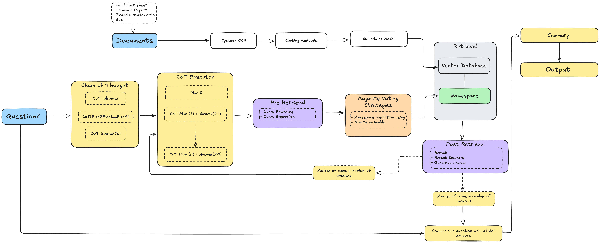
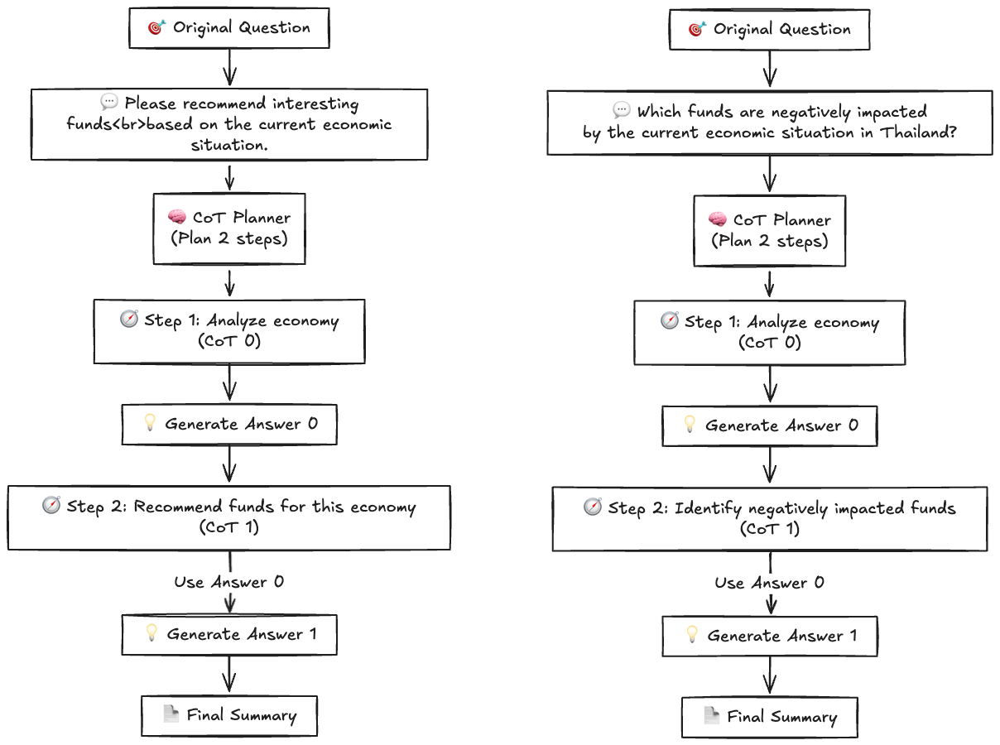

# DoTA-RAG CoT Agent

A LangGraph-powered, modular Retrieval-Augmented Generation (RAG) pipeline designed for investment research and Chain-of-Thought (CoT) reasoning. Inspired by the DoTA-RAG architecture (Dynamic-of-Thought Aggregation for Web-Scale RAG).

## 🚀 Features

- 🔄 **Chain-of-Thought Planning**: Breaks down complex financial questions into step-by-step reasoning steps using GPT-4o.
- 🧭 **Step Execution**: Executes each reasoning step with focused query generation.
- 📝 **Summary Generation**: Generates a final professional financial summary, incorporating all prior reasoning steps and sources.
- 🔍 **Query Rewriting**: Refines vague or incomplete user queries for better semantic retrieval.
- 🧠 **Namespace Prediction**: Dynamically routes the query to the most relevant index (e.g. fund, stock, macro).
- 🔁 **RAG Custom Indexing**: Seamlessly switches between multiple vector indexes (e.g. fund, economy) using namespace routing.
- 📚 **Document Search**: Embeds and retrieves top-k documents from Pinecone vector store.
- 🎯 **Reranking**: Uses Cohere’s rerank API to sort documents by relevance to the rewritten query.
- ✍️ **Answer Generation**: Synthesizes a final response using top documents via GPT-4o.
- 🧱 **Modular Nodes**: Each step is a separate async node in a LangGraph workflow.
  
## 🧩 Architecture

```
CoTPlanner → CoTExecutor → RewriteQuery → Expansion 
→ PredictNamespace → Search → Rerank 
→ RerankSummary → Generate → Summary
```

The system dynamically selects the appropriate vector index in the Search node based on predicted namespace. See `backend/nodes/search.py` for implementation.



- Built with `langgraph`, `langchain`, `pinecone`, `cohere`, and `openai`.

## 📦 Setup

1. Clone this repository.
2. Install dependencies:
   ```
   uv pip install -r requirements.txt
   ```
2.1. Install NLTK tokenizers:
   ```bash
   python -m nltk.downloader punkt
   python -m nltk.downloader punkt_tab
   ```
3. Set up environment variables:
   ```
   OPENAI_API_KEY=your-openai-key
   COHERE_API_KEY=your-cohere-key
   PINECONE_API_KEY=your-pinecone-key
   ```

3.5. Prepare RAG Documents (OCR + Index):

   For fund documents (OCR already done):
   ```
   python src/create_rag_fund_pinecone.py
   ```

   For economic PDFs using Typhoon OCR:
   ```
   python src/prepare_rag_econ_ocr_only.py
   ```

   For fund PDFs using Typhoon OCR:
   ```
   python src/prepare_rag_fund_data_orc_only.py
   ```

4. Run the graph:
   ```python
   from backend.graph import DoTACotGraph
   graph = DoTACotGraph("ช่วยแนะนำกองทุนที่เหมาะกับคนวัยเกษียณ")
   async for state in graph.run({}):
       print(state.get("final_summary", ""))
   ```

## 🧾 Example



## 📚 Reference

- [DoTA-RAG (arXiv:2506.12571)](https://arxiv.org/abs/2506.12571)
- Pinecone, Cohere, OpenAI APIs
- LangGraph: https://github.com/langchain-ai/langgraph

## 🔧 Maintainer

Built by [Ohm Ji] for experimental use in intelligent financial agents.

## 📄 License

This project is licensed under the MIT License. See the [LICENSE](LICENSE) file for details.
